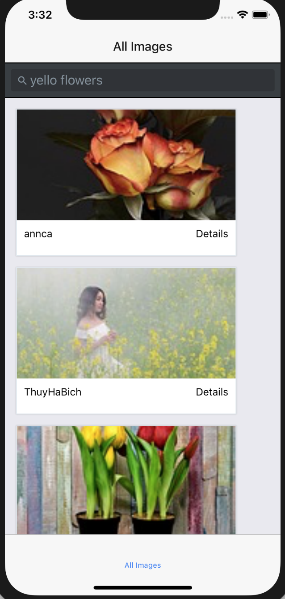
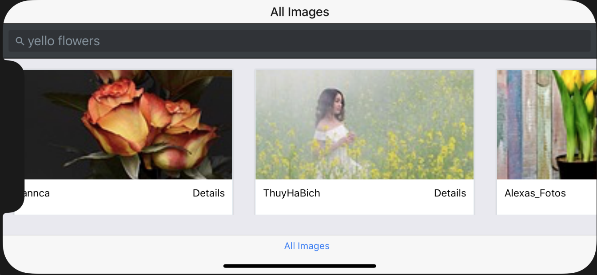

Image search application built with react native.

#### `npm install`

Before running the app, don't forget to npm install.

#### `requires xcode simluator`
this app needs xcode simulator to run the app.

#### `npm run ios`

Like `npm start`, but also attempts to open your app in the iOS Simulator if you're on a Mac and have it installed.

#### `Pictures of how this app looks like: `

#### `Portrait`

#### `Landscape`

#### `Single Page`

Note: this project was bootstrapped with [Create React Native App](https://github.com/react-community/create-react-native-app).

